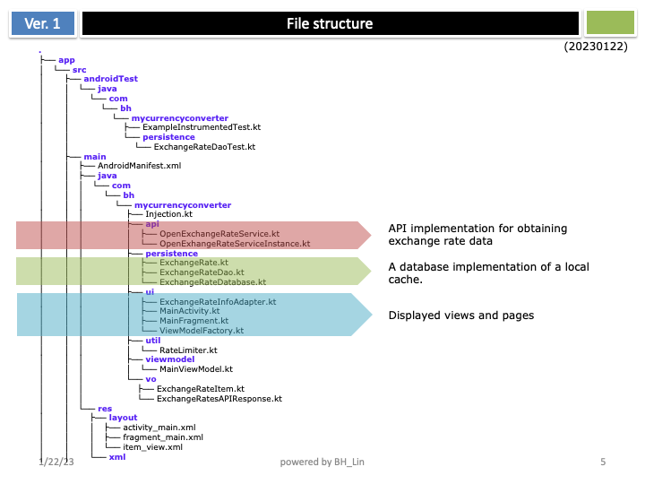
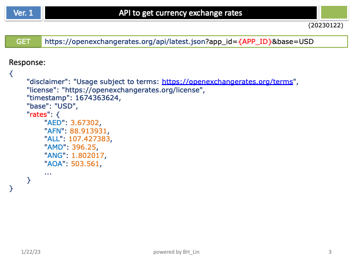
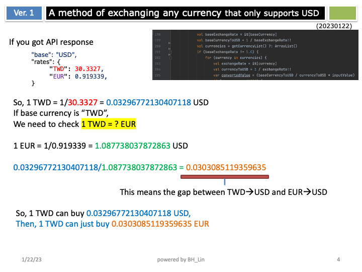
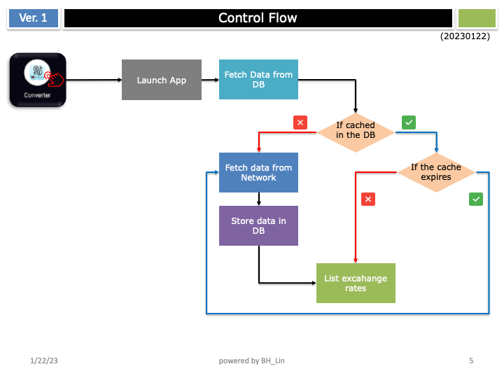
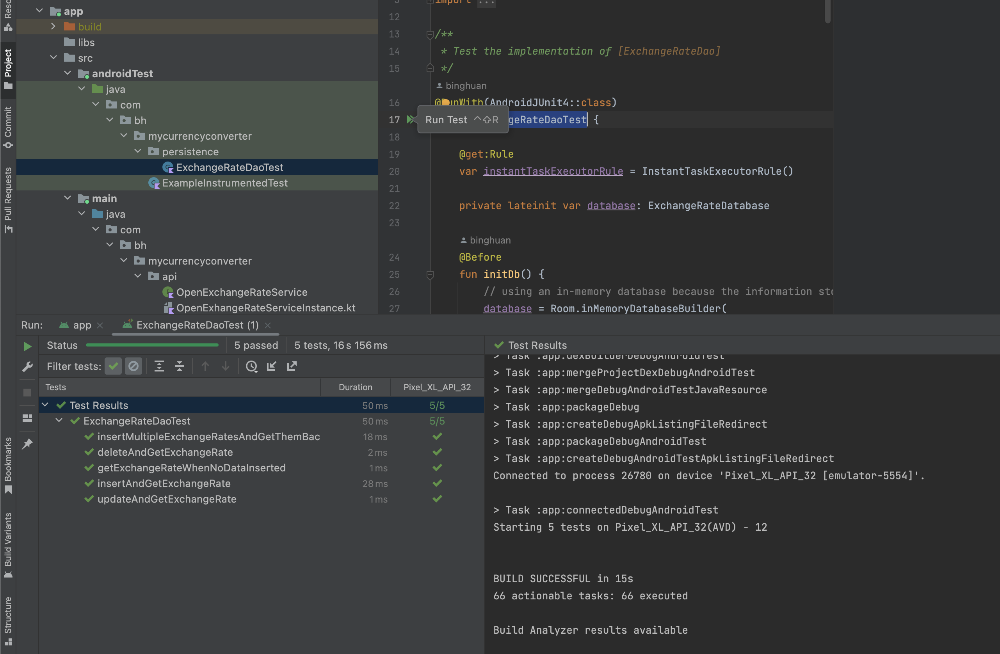
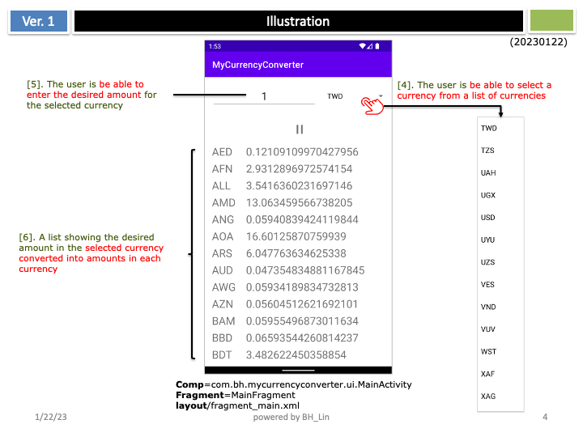
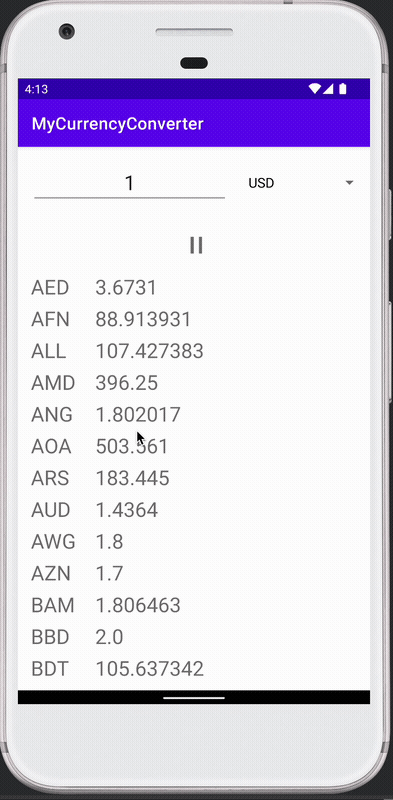

# MyCurrencyConverter
================================================

A currency conversion app that allow a user to view a given amount in a given currency converted into other currencies.  
(It's a coding challenge from PayPal)
[Here is the requirements for the home assignment.](README/requirements.pdf)

## Table of Contents
- [MyCurrencyConverter](#mycurrencyconverter)
  - [Table of Contents](#table-of-contents)
  - [Features](#features)
  - [File Structure](#file-structure)
  - [APIs](#apis)
  - [Conversion Method](#conversion-method)
  - [Control Flow](#control-flow)
  - [Android Test for Dao](#android-test-for-dao)
  - [Illustration](#illustration)
  - [DEMO](#demo)

## Features
- The user is be able to select a currency from a list of currencies
- The user is be able to enter the desired amount for the selected currency
- A list showing the desired amount in the selected currency converted into amounts in each currency

## File Structure

## APIs

## Conversion Method

## Control Flow

## Android Test for Dao

## Illustration

## DEMO

